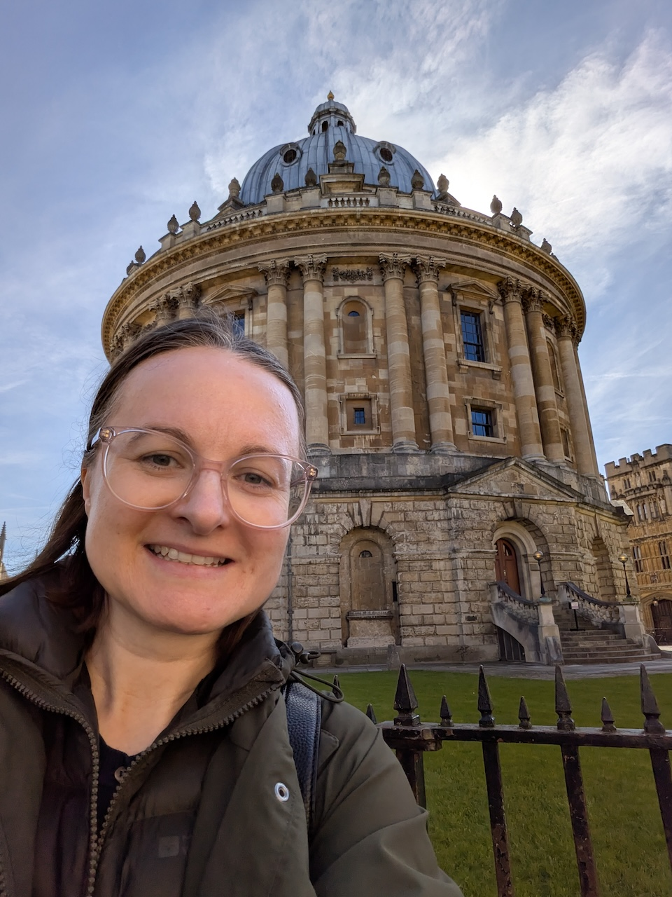

# GosiaG-github.io
CV

 #### MALGORZATA GAWEDZKA
e-mail: gosia.gawedzka2022@gmail.com 
LinkedIn: https://www.linkedin.com/in/malgorzata-gawedzka/

### Profile
Data Scientist with 6+ years of experience delivering advanced data science solutions within the assessment and enterprise sectors. Proven track record at Cambridge University Press & Assessment, developing machine learning models for international exam forecasting, streamlining business processes, conducting statistical studies, and leveraging AI to automate business processes. Committed to sustainable data practices, having contributed to digital carbon footprint initiatives. Navigating agile environments to deliver high-impact, data-driven solutions. Aspiring to make an impact while building on experience in data science, biology, chemistry, and pharmacology from leading organisations. Actively expanding technical repertoire with Modern C++ and regular attendance at leading innovation summits to remain at the forefront of emerging AI technologies.

### Data Science Work Experience

**Jun/23 - Feb/26      Cambridge University Press and Assessment**, Cambridge, UK
                       Associate Data Scientist
* Optimised and streamlined SAS infrastructure for 10 scheduled daily jobs related to examinations results  (e.g., Malpractice Screening, Statistics).
* Monitored daily operational jobs by rotating as a Duty Manager.
* Developed a Marker Monitoring program to flag aberrant examiners.
* Piloted AI use case in generating GCSE exam questions.
* Investigated predictive sales analytics using Salesforce and HubSpot data.
* Engaged stakeholders by presenting results/data-driven recommendations. 
* Shared knowledge at Data Club and Generative AI Guild meet-ups.
* Attended leading innovation conferences regularly to stay up to date.
* Implemented software engineering best practices, including Gitlab and Jira.

**Sep/19 - Jun/23	    Cambridge Assessment**, Cambridge, UK
			                Assistant Data Scientist 
* Quantified the digital carbon footprint of publishing workflows.
* Evaluated machine learning models to forecast student entries.
* Produced statistical reports on GCSE uptake and provision.
* Validated marking methods using statistics and machine learning.
* Developed Power Bi dashboards using Google Analytics data.
* Verified data integrity between databases and historical records.

### Laboratory Work Experience

**Jan/14 - Apr/14       University of Cambridge**, Department of Pharmacology, UK  
Research Assistant  
* Assisted in analysis of BCL11a gene function in mammary cell lines.
* Genotyping, DNA/RNA extraction, RT-PCR.

**Jan/13 - Dec/13 	   Newcastle University, Northern Institute for Cancer Research**, UK  
Research Technician  
* Assisted in shRNA screening in Acute Lymphoblastic Leukaemia.
* Prepared DNA libraries for Illumina High Throughput Sequencing.

**May/12- Aug/12	    University of Oxford**, Department of Pharmacology, UK  
MSc Research Thesis Student  
* Project: Interactions between the Immune System and 5-HT 2A R signaling.
* Quantitatively measured chemokine levels in the liver utilizing RNA extraction, cDNA production and RT-PCR techniques.

### Education

**2019-2023		Anglia Ruskin University,		BSc in Data Science** (apprenticeship)
			            Cambridge, UK			1st Class Honours, Distinction

**2011-2012		University of Oxford** (New College)	MSc in Pharmacology
			        Oxford, UK				

**2005-2010		Northeastern Illinois University**,	BSc in Biology and Chemistry
              Chicago, USA				Cum Laude, Honours

### Skills

**Programming:**		Python, R, SAS, SQL 

**Project Management:**	Jira, Gitlab version control

**Data Platforms:** 	PowerBi, Power Automate, Cloudera DS Workbench, VSC
			
**Communication:** 	presentation, reporting, problem solving, decision making

